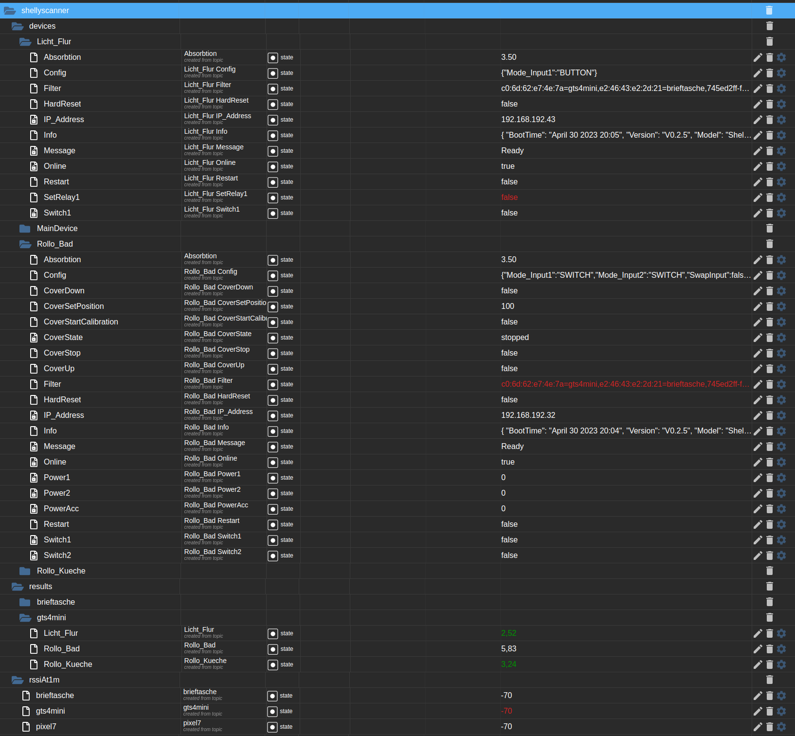

# ShellyNimBLE

Dieses Projekt dient dazu, Shelly Devices mit ESP32 Microcontroller (Single-Core) als BLE Scanner zu verwenden. Es gibt favorisierte Projekte, wie espresense, die aber noch keine SingleCore ESP32 unterstützen.

Die Firmware kann dazu genutzt werden, die Shelly weiterhin zur Steuerung von Lichtern oder Rollläden zu verwenden. Die Kommunikation erfolgt über MQTT (optimiert für ioBroker).
Mit der aktuellen Version können BLE Geräte über ihre MAC oder, wenn vorhanden, über ihre iBeacon UUID gescannt und gefiltert werden (Funktion als Whitelist). 

Der Scanprozess ist kontinuierlich aktiv. Meine Smartwatch "Amazfit GTS4 Mini" sendet sekündlich einen BLE Advertisement. Bei meinen Tests wurden ca. 330-360 von 500 Advertisements empfangen. Das bedeutet, dass durchschnittlich innerhalb von 3 Sekunden 2 Aktualisierungen empfangen werden.

Über MQTT werden zwei Werte pro BLE-Gerät übertragen:

1. der empfangene, ungefilterte RSSI-Wert 

2. ein gemittelter Wert in Meter. Berechnung: Zunächst wird vom RSSI der Median der letzten drei Werte berechnet, anschließend erfolgt die Umrechnung in Meter, abschließend wird ein laufender Mittelwert über die letzten 5 Werte gebildet. 

Aktuell werden folgende Shelly unterstützt:

* Shelly-Plus-1(PM)
* Shelly-Plus-2PM
* Shelly-Plus-i4

**Inhaltsvereichnis:**

* [ioBroker States Übersicht](#ioBroker-States-Übersicht)
* [MQTT Konfiguration ioBroker](#mqtt-konfiguration-ioBroker)
* [Firmware Binaries unter Releases](#Firmware-Binaries-unter-Releases)
* [Erstmalig Flashen mit esptool](#Erstmalig-Flashen-mit-esptool)
* [Erstmalig Flashen mit PlatformIO](#Erstmalig-Flashen-mit-PlatformIO)
* [OTA Flashen über Webportal](#OTA-Flashen-über-Webportal)
* [Konfiguration des Shelly](#Konfiguration-des-Shelly)
* [Rollladen / COVER](#Rollladen-/-COVER)
* [Reset-Taste am Shelly](#Reset-Taste-am-Shelly)
* [JavaScript für Optimierung der MQTT States](#JavaScript-für-Optimierung-der-MQTT-States)
* [Changelog](#Changelog)

## ioBroker States Übersicht

Die States innerhalb von ioBroker werden automatisch erstellt, wenn eine MQTT Instanz läuft. Ich bevorzuge unter ioBroker den MQTT-Client, da ich Mosquitto als MQTT-Server verwende. Nachfolgend sind als Beispiel zwei Shellies zu sehen; ein ShellyPlus 2PM als COVER und ein ShellyPlus 1 als LIGHT:



Im State `mqtt-client.0.shellyscanner.devices.*.Filter` können MAC-Adressen / iBeacon-UUIDs eingegeben werden. Die Eingaben müssen über ein Komma getrennt werden. Außerdem können optional Aliase vergeben werden. Nach dem Flashprozess ist ein Beispiel im State hinterlegt.

## MQTT Konfiguration ioBroker

Ich verwende Mosquitto als MQTT server und verwende unter ioBroker den Adapter MQTT-Client. Ein Versuch von Mosquitto auf ioBroker MQTT-Server zu wechseln, war gescheitert.

Es wird empfohlen, dass zunächst die ioBroker MQTT Instanz konfiguriert wird und anschließend das Flashen erfolgt.

Damit die States von ioBroker erkannt werden, muss unter der MQTT Client Instanz eine Subscription auf `shellyscanner/#` eingestellt werden:


**Nach** dem Flashprozess - beschrieben in nachfolgenden Kapiteln - kann die Steuerung des Shelly über die automatisch erstellten ioBroker States erfolgen. Für ausgehende States muss "publish" aktiviert werden. Hier ein Beispiel für einen beliebigen State:

* Zunächst auf das Zahnradsymbol des States klicken
* MQTT Instanz aufklappen und Checkbox publish aktivieren


Publish sollte für alle States, außer den nachfolgenden erledigt werden:

* IP_Address (Zur Info, welche IP das Gerät hat)
* Info (Boot-Zeit, FW-Version)
* Message (Empfang von zuätzlichen Informationen)
* Online (Anzeige des Online-Zustandes)
* Switch1 und ggf. Switch2 (Anzeige ob Inputs am Shelly anliegen)

**Für die einfache Konfiguration der States habe ich ein JavaScript für ioBroker erstellt, siehe weiter unter:**  [JavaScript für Optimierung der MQTT States](#JavaScript-f%C3%BCr-Optimierung-der-MQTT-States)

**Vor Anwendung des Skripts sollte zumindest einamilg geprüft werden, dass die MQTT Optionen - wie in den Screenshots zu sehen - vorhanden sind.**

## Firmware Binaries unter Releases

Zu jedem Release werden zwei Dateien hinzugefügt:

* firmware_full.bin

* firmware_update.bin

Wenn **erstmalig** mit esptool geflasht wird, muss **firmware_full.bin** verwendet werden. Hier sind alle benötigten Partitionen vorhanden, weshalb diese Binary eine Größe von genau 4MB aufweist.

Zukünftige **Updates** können über die **WebUI** des Shelly erfolgen. Es ist eine simple OTA Funktionalität integriert. Hier wird dann die **firmware_update.bin** verwendet, damit Einstellungen, wie die Konfiguration, Filter, WIFI etc. beibehalten werden.

## Erstmalig Flashen mit esptool

Das Flashen kann über esptool.py erfolgen, was von hier bezogen werden kann:

[GitHub - espressif/esptool: Espressif SoC serial bootloader utility](https://github.com/espressif/esptool)

Hilfreiche Befehle sind zum Beispiel:

* Backup der original Firmware
  
  `esptool.py read_flash 0x0 0x400000 fw-backup-4M.bin`

* Löschen des Flash-Speicher:
  
   `esptool.py erase_flash`

* Schreiben des Flashspeichers:
  
   `esptool.py --baud 115200 write_flash 0x0 firmware_full.bin`

## Erstmalig Flashen mit PlatformIO

<details>
  <summary>Für mehr Infos hier klicken</summary>
  <br>

PlatformIO ist ein Plugin, dass unter VSCode eingesetzt wird. Es ist zum Standard für größere Projekte geworden und bietet einige Vorteile gegenüber der Standard Arduino-IDE.

Wenn VSCode installiert wurde, kann PlatformIO als Plugin installiert werden:

(es schadet nicht, VSCode einmalig neu zu starten, wenn PlatformIO installiert wurde)


Als nächstes wird dieses Projekt als zip von Github heruntergeladen und lokal entpackt. Dieser Ordner wird PlatformIO als Projekt hinzugefügt:

Meistens wird das Fenster "PIO Home" automatisch geöffnet, wenn dies nicht der Fall ist, unten über das Haus-Icon manuell öffnen.


Da mehrere Projekte in PlatformIO existieren können, müssen wir unser Projekt nun innerhalb vom PIO-Home Fenster auswählen:


Das kompilieren und hochladen der Firmware erfolgt entweder mit angeschlossenem Flasher. Hier bitte zunächst den Schritt "Erase Flash" ausführen, wenn erstmalig geflasht wird.


Mit PlatformIO kann auch direkt OTA geflasht werden. Für den OTA Upload muss die platformio.ini aus dem Projekt geöffnet werden und in der entsprechenden Section die IP des Shellys angepasst werden.


</details>

## OTA Flashen über Webportal

Wenn auf dem Shelly diese Firmware über eine der oben beschriebenen Wege bereits geflasht wurde, kann über die IP des Shellys auf die Web OTA Funktion zugegriffen werden.
Für den OTA Flashvorgang muss aus den Releases die `firmware_update.bin` verwendet werden. 

## Konfiguration des Shelly

Wenn der Shelly erfolgreich geflasht wurde, wird mit dem ersten boot ein AccessPoint mit dem Namen `esp32-Shelly` gestartet. Bitte mit diesem verbinden, eine Weiterleitung sollte automatisch erfolgen, ansonsten im Browser die IP `192.168.4.1` aufrufen.

<u>Hier müssen alle notwendigen Daten eingegeben bzw. ausgewählt werden</u>

(Die Felder sind für schnellere Tests fast alle vorbelegt)


* **WIFI und MQTT** Daten sind selbsterklärend

* Der **Device Name** wird als Bestandteil der MQTT Topics verwendet. Dieser sagt somit aus, unter welchem Namen dieses Gerät später zu sehen ist. Als Sonderzeichen ist hier ausschließlich Unterstrich "_" erlaubt.

* Die weiteren Optionen sind selbsterklärend. Die Model-Auswahl und bei Shelly-Plus-2PM der Modus (Cover / Light) können nur über dieses Menü eingestellt werden. Im laufenden Betrieb können die Inpts weiterhin zwischen Switch und Button verändert werden.

Wenn zu einem späteren Zeitpunkt dieses Menü aufgerufen werden soll, ist dies ausschlielich über ein HardReset möglich. Ein Hard-Reset ist möglich über

* Reset-Taste am Shelly ([Reset-Taste am Shelly](#Reset-Taste-am-Shelly))

* den ioBroker State HardReset

* esptool / PlatformIO mit erase-flash

Es kann der Bedarf bestehen, dass die Eingangs- oder Ausgangs-Pins des Shelly vertauscht werden; dies kann über den ioBroker State`mqtt-client.0.shellyscanner.devices.*.Config`erfolgen. Je nach Shelly Modell sind hier als JSON mehrere Optionen hinterlegt. Die meisten Optionen bietet der Shelly-Plus-2PM:

```js
{
  "Mode_Input1": "SWITCH", /* SWITCH / BUTTON */
  "Mode_Input2": "SWITCH", /* SWITCH / BUTTON */
  "SwapInput":   true,     /* true / false */
  "SwapOutput":  false,    /* true / false */
  "is_V019":     false     /* true / false */
}
```

Beim Shelly-Plus-2PM gibt es zwei verschiedene Platinen-Layouts, die vertrieben werden, v0.1.5 und v0.1.9. Die korrekte Version wird automatisch erkannt, der Shelly erstmalig verwendet wird (erster Boot nach Web-Konfiguration). Wenn die Erkennung nicht korrekt war, kann dies auch über den Congig-State in ioBroker korrigiert werden.

## Rollladen / COVER

Für Rollläden kann über MQTT eine Kalibrierung gestartet werden. Solange keine Kalibrierung durchgeführt wurde, kann über die Taster hoch- und runtergefahren werden. Eine Positionsvorgabe kann nicht durchgeführt werden. 

Ein Rollladen kann über die drei States CoverUp, CoverDown und CoverStop gesteuert werden. Außerdem ist nach erfolgter Kalibrierung eine Sollvorgabe über SetPosition möglich.

Hinweis: Ein Schalten der beiden Ausgänge gleichzeitig ist seitens Software verriegelt.

## Reset-Taste am Shelly

* Wird die Taste zwischen 0,2s und 10s betätigt, wird es neu gestartet

* Wird die Taste länger als 10s betätigt, erfolgt ein HardReset. Hinterlegte Daten für WIFI und MQTT werden gelöscht. Das Gerät bootet nun in den AP-Mode.

## JavaScript für Optimierung der MQTT States

Wenn MQTT States von ioBroker automatisch generiert werden, sind diese grundsätzlich beschreibbar, publish ist deaktiviert. Ich habe ein kleines Skript geschrieben, dass die States gemäß den Anforderungen konfiguriert, wobei auch die State-Namen den Device-Namen als Präfix erhalten. Dafür muss das Skript in der ioBroker Skript-Engine einmalig ausgeführt werden. Es beendet sich selbst, wenn es durchlief ud muss nochmals gestartet werden, wenn später weitere Shellys hinzukommen.

Dieses Skript funktioniert, wie hier hinterlegt, ausschließlich über die Instanz 0 vom MQTT-Client Adapter. Wenn andere Instanzen verwendet werden, muss das Skript entsprechend angepasst werden.

Eingerichtet wird:

* State-Typ auf "boolean" (wenn passend)

* Aktiviere "publish"  wenn für Shelly Steuerung vorgesehen

* State-Attribut auf ReadOnly setzen (wenn passend)

* State-Typ auf "number" bei den RSSI-States

```javascript
let arrReadOnly = [
    "CoverState",
    "Message",
    "Online",
    "IP_Address",
    "Power1",
    "Power2",
    "PowerAcc",
    "Switch1",
    "Switch2",
    "Switch3",
    "Switch4"
]

let arrBooleans = [
    "HardReset",
    "Online",
    "Restart",
    "SetRelay1",
    "SetRelay2",
    "Switch1",
    "Switch2",
    "Switch3",
    "Switch4"
]

$('mqtt-client.0.shellyscanner.devices.*.*').each(function ( id, i) {
    let splittedID = id.split(".");
    let lastItem = splittedID.pop();
    let deviceName = splittedID.pop();
    let obj = getObject( id);

    if ( !obj.common.name.includes( deviceName) ) obj.common.name = deviceName + " " + obj.common.name; // change name

    if ( arrReadOnly.includes( lastItem) ){
        // disable publish and write access
        obj.common.write = false;
        obj.common.custom["mqtt-client.0"].publish = false;
    }
    else {
        // enable publish and write access
        obj.common.write = true;
        obj.common.custom["mqtt-client.0"].publish = true;
    }

    if ( arrBooleans.includes( lastItem) ){
        // set boolean mode
        obj.common.type = "boolean";
    }

    setObject( id, obj);
});

$('mqtt-client.0.shellyscanner.results.*').each(function ( id, i) {
    let obj = getObject( id);

    if ( obj.common.type === "mixed"){
        // set boolean mode
        obj.common.type = "number";
    }

    setObject( id, obj);
});

$('mqtt-client.0.shellyscanner.rssiAt1m.*').each(function ( id, i) {
    let obj = getObject( id);

    obj.common.custom["mqtt-client.0"].publish = true;
    obj.common.custom["mqtt-client.0"].retain = true;
    setObject( id, obj);
});

stopScript();

// lösche retained messages: mosquitto_pub -t shellyscanner/devices/Licht_Schlafzimmer/Online -n -r -d
```

## Known Bugs

* Ein User hatte nach der erfolgter Erst-Konfiguration über das CaptivePortal ein Boot-Loop. Bisher konnte ich den Fehler weder nachstellen, noch beheben.

## Geplant

* [ ] ioBroker JavaScript erweitern: Lösche States unter "results" wenn zugehöriger Shelly unter "devices" nicht mehr existiert. Z.B. nach HardReset / Umbenennen eines Shelly.
* [x] Zeitpunkt der Ersteinrichtung über Info-State mitteilen.
- [x] COVER: Beim Anfahren der Endposition anhalten wenn Leistung abfällt.
  Aktuell gelöst bei EndPosition "Berechnete Endzeit + 2s". Wenn nicht kalibriert, kein autom. Öffnen der Relais möglich.
- [ ] COVER: ErrorHandling erweitern, wenn während Kalibriervorgang nie geringe Leistung erreicht wird.
- [ ] Power Messintervall bei 500ms. Wert 100ms führt zu "task watchdog error". Optimierbar?
- [ ] MaxPower für Relais einrichten. Über mqtt einstellbar (Persistent sichern).
- [ ] Temperaturmessung hinzufügen? Öffne Relay wenn Temperatur X überschritten wurde?
- [x] Distanz statt RSSI, aktuell fix mit -70 rssi@1m
- [x] rssi@1m aus Advertisement auslesen und über MQTT einstellbar gestalten
- [x] Absorbtion pro Device über MQTT einstellbar gestalten

---

## Changelog

Siehe unter [Releases · gsicilia82/ShellyNimBLE · GitHub](https://github.com/gsicilia82/ShellyNimBLE/releases)
